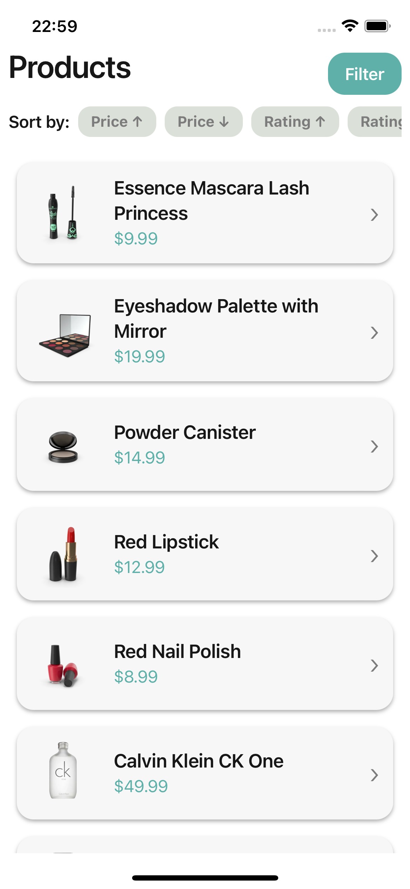
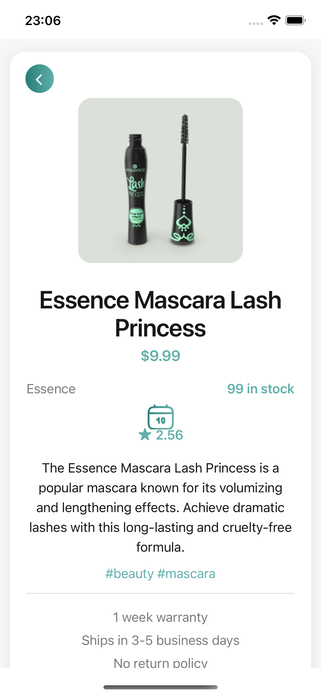

# Products App

A cross-platform mobile application to browse, filter, and explore a catalog of products, built with React Native and TypeScript.

## Features

- Browse a list of products with title, price, and thumbnail
- Filter products by category (e.g., electronics, clothing, groceries)
- Sort products by price or rating
- View detailed product information: description, brand, stock, reviews, and more
- Add a purchase reminder to your device calendar (native integration)
- Push notifications for product actions
- Deep linking support to open specific products or categories

## Technologies Used

- **React Native** (CLI, not Expo)
- **TypeScript**
- **@tanstack/react-query** for data fetching and caching
- **React Navigation** for navigation and deep linking
- **Notifee** for push notifications
- **Custom Native Modules** (iOS & Android) for calendar integration
- **Components** and custom stylesheets
- **DummyJSON API** as the product data source

## Screenshots




## Getting Started

### Prerequisites

- Node.js (LTS recommended)
- npm
- Xcode (for iOS) and/or Android Studio (for Android)
- [React Native CLI environment set up](https://reactnative.dev/docs/environment-setup) (not Expo)

### Installation

1. **Clone the repository:**

   ```sh
   git clone https://github.com/gabrielvrl/products-app.git
   cd products-app
   ```

2. **Install dependencies:**

   ```sh
   npm install
   ```

3. **iOS setup:**

- Install CocoaPods dependencies:

  ```sh
    cd ios
    pod install
    cd ..
  ```

4. **Android setup:**
   - No extra steps required if you have Android Studio and SDK set up.

### Running the App

> **Recommended:** Start the Metro bundler first by running:
>
> ```sh
> npm run start
> ```

#### Android

```sh
npm run android
```

#### iOS

```sh
npm run ios
```

> Make sure you have a simulator or device connected.

### Fast Refresh

Edit any file (e.g., `App.tsx`) and save to see changes instantly in the app.

### Deep Linking

You can open the app directly to a specific product or category using deep links. Example:

```
products-app://product/1
products-app://category/beauty
```

### Calendar Integration

Add a product purchase reminder directly to your device’s calendar with a single tap from the product detail screen.

### Push Notifications

Receive push notifications for product actions (local notifications, no backend required).

## Troubleshooting

- If you encounter issues with native modules, try:
  ```sh
  cd ios
  pod install
  cd ..
  ```
- For iOS, ensure you have the correct permissions set in your device settings.
- For more help, see the [React Native Troubleshooting Guide](https://reactnative.dev/docs/troubleshooting).

## License

This project is open source and available under the [MIT License](LICENSE).
